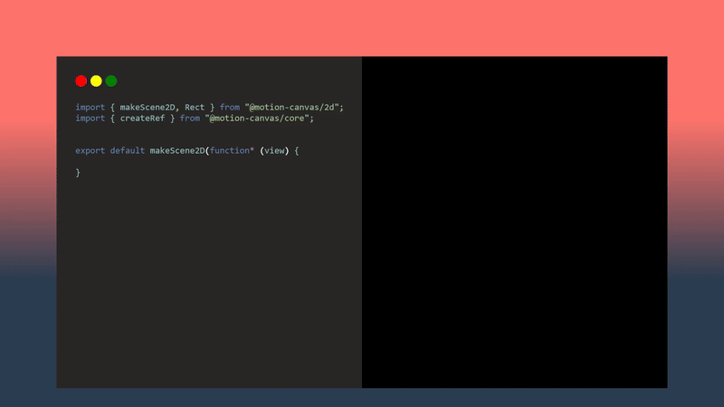

# Fileverse

A simple ruby cli tool for keeping different versions of a file.

## Installation

    $ gem install fileverse

## Usage

    $ fileverse {file_path} {command} {options}

## Commands / Shortcuts
    - snap                          {file_path}             (s)
    - preview       --bwd           {file_path}             (p)
    - preview       --fwd           {file_path}             (p)
    - preview       --name=""       {file_path}             (p)
    - preview       --index=0       {file_path}             (p)
    - reset                         {file_path}             (x)
    - summary                       {file_path}             (sm)
    - restore                       {file_path}             (r)

## Sample

## Development

After checking out the repo, run `bin/setup` to install dependencies. Then, run `rake spec` to run the tests. You can also run `bin/console` for an interactive prompt that will allow you to experiment.

To install this gem onto your local machine, run `bundle exec rake install`. To release a new version, update the version number in `version.rb`, and then run `bundle exec rake release`, which will create a git tag for the version, push git commits and the created tag, and push the `.gem` file to [rubygems.org](https://rubygems.org).

## Contributing

Bug reports and pull requests are welcome on GitHub at https://github.com/urchmaney/fileverse. This project is intended to be a safe, welcoming space for collaboration, and contributors are expected to adhere to the [code of conduct](https://github.com/[USERNAME]/fileverse/blob/master/CODE_OF_CONDUCT.md).

## License

The gem is available as open source under the terms of the [MIT License](https://opensource.org/licenses/MIT).

## Code of Conduct

Everyone interacting in the Fversion project's codebases, issue trackers, chat rooms and mailing lists is expected to follow the [code of conduct](https://github.com/[USERNAME]/fversion/blob/master/CODE_OF_CONDUCT.md).
